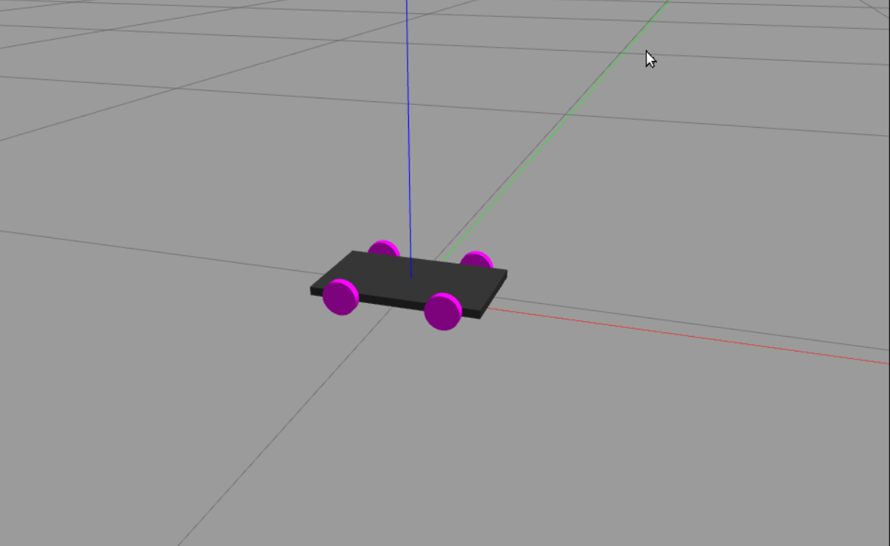

## A 4-wheel differential mobile robot URDF

***Note : This repo is work in progress***



The repository includes a URDF/Xacro description of a 4-wheel differential mobile robot

To install the package 

```
catkin build arduino_communication_server
```
To launch in RViz
```
roslaunch car_robot rviz.launch
```
To luanch in Gazebo
```
roslaunch car_robot gazebo.launch
```